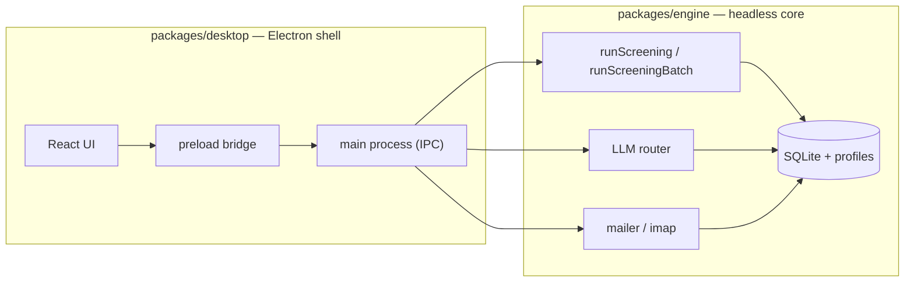
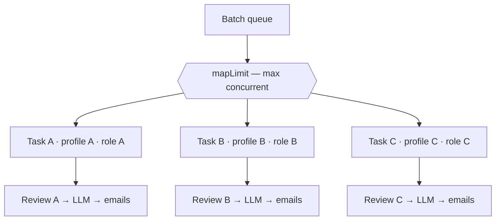

# AVANZARE — Scalable structure

This document explains how AVANZARE is built to scale — from a single recruiter
screening one folder of CVs, up to many concurrent hiring instances drawing from
live inboxes and offloading ranking to whatever LLM the situation calls for.

Scalability was a founding requirement (`instructions.txt`, point 3): the app must
run on a server alongside other software, cooperate with resource-management tools,
and be able to run in the background. Every design decision below traces back to
that, plus the practical demands of real hiring: more roles, more applicants, more
recruiters, and wildly different privacy/compute budgets per client.

A quick vocabulary note used throughout:

- **Technical profile** — a saved bundle of *connection & runtime* settings: CV
  source, LLM provider/endpoint, SMTP identity, OCR, export folder, concurrency.
- **Job** — a single screening definition: keywords, requirement tags, hiring
  target, and the LLM job description. Jobs are independent of profiles.
- **Run / hiring instance** — one execution of a job against a source.

The separation of *profile* (how to connect) from *job* (what to screen for) is the
first scalability property: one profile is reused across many jobs, and one job
shape can be pointed at many profiles.

---

## 1. The foundation: a headless engine, a thin shell

All real logic lives in **`packages/engine`** as plain async functions over a SQLite
database and a profile store — it imports nothing from Electron. **`packages/desktop`**
is a thin shell: the main process owns the engine and exposes it over IPC, a
context-isolated preload bridges it to a React UI.

Why this matters for scale: the expensive path to "run in the background on a server"
is already paid for. A future CLI or Windows service can drive the *same* engine
functions (`runScreening`, `runScreeningBatch`, `runLlmAnalysis`, `sendDecisionEmails`,
…) with no window attached, supervised by any process manager, while an Electron app
connects remotely. Nothing about the core assumes a human is watching.

---

## 2. Scaling the work: multitasking across hiring instances

The **Batch** tab (`pipeline/batch.ts`, `views/Batch.tsx`) runs many hiring instances
**concurrently**. Each queued task carries its *own* technical profile plus its own
keywords/description, so a single batch can span different clients, recruiters, mailboxes,
LLM endpoints, and sending identities at once.

- **Bounded parallelism.** Tasks run through a `mapLimit` pool sized by a *Max
  concurrent* knob, so you dial throughput against the machine's headroom rather than
  launching an unbounded stampede.
- **Isolated per task.** Every task writes its own job and application rows; one task
  failing (bad mailbox, unreachable LLM) is captured as that task's error and never
  aborts the others.
- **Concurrency-safe storage.** SQLite runs in **WAL mode** (`database.ts`) and
  `better-sqlite3` writes are synchronous, so concurrent tasks interleave at their I/O
  await points while each actual write is atomic — no corruption, no lock thrash.
- **Human review stays per task.** Automation stops after parse + keyword screening;
  each finished task hands off to the normal rejection → LLM → email wizard, driven by
  *that task's* profile. This keeps the compliance guarantee (a human confirms every
  email batch) intact even as the number of instances grows.

### Across different users

Today AVANZARE runs as a per-user desktop install, and it scales across users along
three real seams:

- **Profiles as tenants.** Each recruiter/client is a named profile with its own
  source, LLM, and SMTP identity; a batch mixes them freely.
- **Attribution.** Every consequential action is written to the audit log with the OS
  username as actor and, for emails, the CV path + SHA-256 content hash — so a shared
  machine keeps a per-user paper trail.
- **Server-ready core.** Because the engine is UI-free and stateless between calls, the
  same functions can back a multi-user service with a shared database. That server mode
  is designed for but not yet shipped (see §10).

---

## 3. Scaling intake: read applications straight from a mailbox

Manually curating a folder doesn't scale past a handful of roles. AVANZARE can pull
applications directly from an inbox (`sources/imap.ts`, via `imapflow` + `mailparser`).

- **Gmail / any IMAP.** Point it at a dedicated hiring inbox — Gmail is
  `imap.gmail.com:993` with an **app password** (2FA + app password, IMAP enabled) — or
  a dedicated label on a shared address.
- **Per-run date range.** Each run imports only messages in a chosen window, so intake
  is incremental rather than all-or-nothing.
- **Idempotent by message-id.** Imported message-ids are recorded (`imported_emails`),
  so overlapping ranges and repeated runs never double-import — you can safely re-run on
  a schedule.
- **Contact for free.** The sender's `From` address/name becomes a high-confidence
  contact hint, so email-sourced applicants essentially always have a reachable address
  (no "no email found").
- **Durable, then reuse the pipeline.** Attachments are materialized to
  `userData/email-cvs/<run>/` and flow through the exact same parse → screen → score
  path as local files. Because these are app-created copies, purging a candidate deletes
  them (GDPR), while your own source folders are never touched.

The result: applicants can flow in continuously from a live channel, and the volume you
can absorb is bounded by mailbox and disk, not by manual filing.

> Cloud object sources (Drive / OneDrive / S3) are stubbed behind `AVZ-SRC-403`; the
> IMAP inbox is the supported network source today, and a synced cloud folder works via
> the local-folder path in the meantime.

---

## 4. Scaling compute: local, remote, and API LLMs

Ranking is the heaviest stage, and different clients have opposite needs — some demand
that CVs never leave the building, others want maximum quality and have API budget.
AVANZARE treats the LLM as a swappable, per-profile backend behind one interface
(`llm/router.ts`).

| Option | How | When it fits | Data path |
|---|---|---|---|
| **Local Ollama** | Base URL `http://localhost:11434` | Private, free, offline-capable | CVs never leave the machine |
| **Remote Ollama** | Base URL of another box, e.g. `http://192.168.1.50:11434` | Offload ranking to a GPU server; many light clients, one heavy model host | CVs stay on your network |
| **Claude API** | `@anthropic-ai/sdk`, key from console.anthropic.com | Highest quality, no local GPU, elastic capacity | CV text is sent to Anthropic |

- **"LLM on another machine" is just a URL.** Moving ranking to a beefier host is a
  settings change, not a code change — so compute scales independently of the desktops
  running the UI.
- **One interface, structured output.** Both providers return the same
  JSON-schema-constrained verdict (`{score 0–100, reasoning, education, requirement
  tags}`), so results are reliable even on small local models and the pipeline never
  knows which engine answered.
- **Per-profile choice.** A privacy-sensitive client can run local Ollama while another
  in the same batch uses Claude — each task carries its own provider.
- **Typed failure mapping.** SDK/HTTP errors map onto stable `AVZ-LLM-*` codes
  (auth → 206, rate limit → 207, unreachable → 201, timeout → 204), so a saturated or
  misconfigured backend surfaces a clear, actionable code instead of a stack trace.

---

## 5. Concurrency & coexistence with other workloads

Running on a shared server means being a good neighbor. Throughput is governed by
bounded pools, not unbounded fan-out.

- **Parsing pool.** Each run processes CVs through a `mapLimit` pool sized by the
  profile's `concurrency` (default **4**, valid **1–64**). Lower it to 2 on a busy box.
- **Batch pool.** The Batch tab adds a second bound — how many *tasks* run at once — so
  total load is `maxConcurrent × per-task concurrency`, both tunable.
- **LLM guard rail.** The scoring stage is hard-capped at `min(concurrency, 2)` in-flight
  requests (`llm/router.ts`), protecting a single Ollama instance or an API rate tier
  from being overwhelmed regardless of the parsing concurrency.
- **Lazy heavy deps.** OCR (`@napi-rs/canvas` + `tesseract.js`) is dynamically imported
  only when a scanned PDF actually needs it, so the common path never pays that memory
  cost.

These knobs are exactly what a resource manager needs to fit AVANZARE into a slice of a
shared server.

---

## 6. Scaling data: a talent pool that grows, not re-screens

State is an embedded SQLite database (`better-sqlite3`) under the per-user data dir —
zero-config, no server to run, WAL mode for concurrent reads during writes.

- **Persistent, deduped talent pool.** Candidates accumulate across every run, deduped
  by email, with full application history. The larger it gets, the more valuable it is.
- **Full-text search at scale.** An FTS5 virtual table (`app_fts`, porter unicode61)
  indexes every stored CV's text and candidate names, with a LIKE fallback if FTS5 is
  ever absent. Sourcing "everyone who mentions Kubernetes and Terraform" across all past
  openings is one query — you re-use the pool instead of re-screening folders.
- **Forward-compatible schema.** Guarded `ALTER TABLE` migrations run on startup, so the
  schema evolves across versions without a manual step or losing history.
- **Extracted text is stored on the application row**, so the LLM stage and re-review
  never re-parse files — parsing cost is paid exactly once per CV.

---

## 7. Scaling configuration: profiles per user, client, or environment

- **Named profiles** store connection/runtime config; save one per client or per
  environment (dev vs prod LLM host), and mark one *use automatically* to skip setup.
- **Secrets encrypted at rest.** SMTP password, Anthropic API key, and IMAP app
  password are sealed with Electron `safeStorage` (`enc:` prefix) before touching disk.
- **Jobs are portable.** Because keywords/prompts live with the job, not the profile,
  the same role definition can be run against different sources or LLMs without
  re-typing.

---

## 8. Robustness at scale

Volume multiplies the chance that *something* is malformed. The app is built to absorb
that without a human babysitting every run.

- **Per-item error isolation.** Parsing, scoring, and email sends collect per-item
  failures and continue — one corrupt PDF or one bad recipient never aborts a run of
  hundreds.
- **Stable error codes.** Every failure carries an `AVZ-<MODULE>-<NNN>` code plus the
  location it occurred; the registry (`errors.ts`) is the single source of truth,
  mirrored in [ERROR_CODES.md](ERROR_CODES.md).
- **Structured logging.** A JSON-lines log records every error with its code and
  location — greppable and machine-parseable for monitoring on a server.
- **Audit trail.** Runs, emails (with CV hash), edits, rescues, notes, and purges are
  recorded with actor and timestamp — the accountability layer a multi-recruiter
  deployment needs.

---

## 9. Scaling dimensions at a glance

| Axis | Mechanism | Knob / where | Source |
|---|---|---|---|
| More roles at once | Concurrent batch tasks | *Max concurrent* | `pipeline/batch.ts` |
| More CVs per run | Bounded parse pool | `concurrency` (1–64) | `util/concurrency.ts` |
| More applicants inflow | IMAP inbox import, idempotent | per-run date range | `sources/imap.ts` |
| More LLM demand | Local / remote / API provider | base URL / provider | `llm/router.ts` |
| Protect the LLM | In-flight cap | `min(concurrency, 2)` | `llm/router.ts` |
| Bigger talent pool | SQLite + FTS5 search | — | `db/database.ts` |
| More clients/users | Named profiles + audit actor | profile store | `config/profiles.ts` |
| Server deployment | Headless UI-free engine | (roadmap) | `packages/engine` |

---

## 10. Where it scales next (designed, not yet shipped)

The architecture leaves clear, low-friction room to grow:

- **Headless CLI / Windows service** — the engine is already UI-free; a supervised
  background runner (scheduled inbox polling, unattended parsing) is the next packaging
  target.
- **Multi-user server mode** — one engine + shared database serving many remote UIs,
  turning "profiles as tenants" into real accounts.
- **Cloud object sources** — Drive / OneDrive / S3 connectors behind the existing
  `AVZ-SRC-403` stub, plus direct cloud export upload.
- **Persistent batch queue** — the queue is currently in-memory (the runs themselves
  persist); durably storing it would let batches survive restarts and resume.
- **Offline OCR bundle** — Tesseract fetches language data from a CDN on first use;
  bundling it makes fully offline/air-gapped installs turnkey.

---

*See also: [ARCHITECTURE.md](ARCHITECTURE.md) for the module map, [USER_GUIDE.md](USER_GUIDE.md)
for the workflow, and [OVERVIEW.html](OVERVIEW.html) for a visual feature/tech map.*
